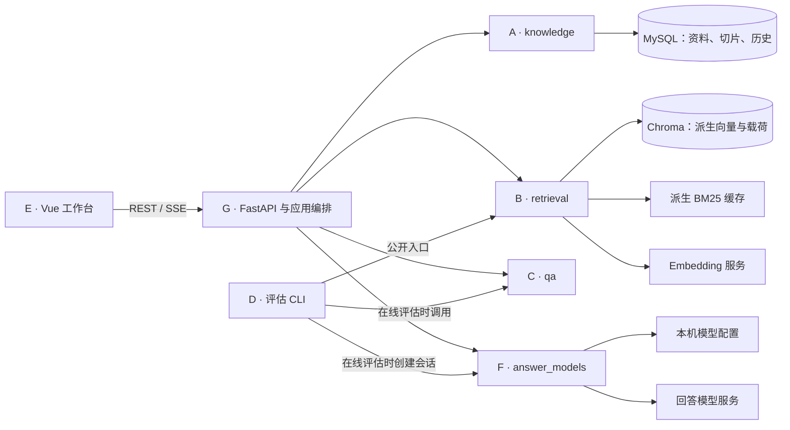
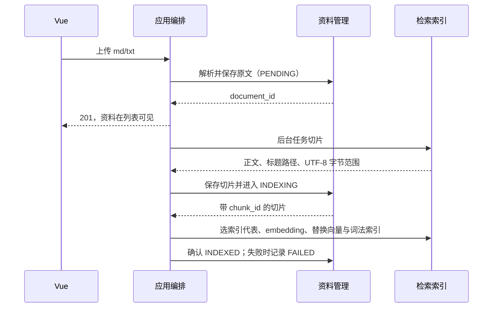
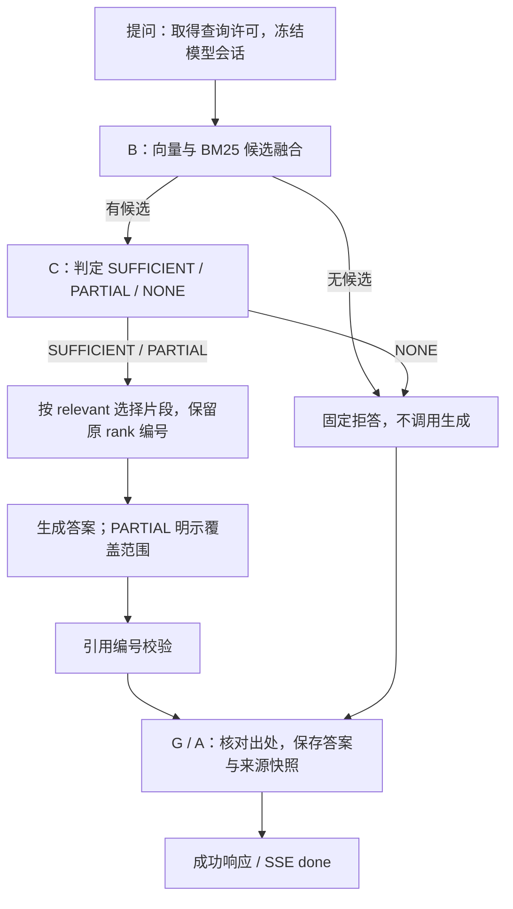

# 架构设计

EasyRAG 是单用户知识库问答应用。Vue 工作台负责资料管理与答案核验，一个 FastAPI 进程承载 HTTP 和应用编排，独立业务模块维护各自的数据与规则。产品范围见 [总功能文档](总功能文档-Issue.md)，启动和维护见 [README](../README.md)，请求与响应见 [API 文档](api.md)。

## 一、模块与资源归属

| 模块 | 职责与私有资源 | 对外能力 |
|---|---|---|
| [A 资料管理](子Issue-A-资料管理.md) | MySQL、SQLAlchemy、Alembic、正文解析、哈希、切片状态、历史快照 | 资料 CRUD、切片保存、索引状态、出处与历史 |
| [B 检索索引](子Issue-B-索引管线.md) | 切片、tokenizer、embedding、Chroma、BM25 与排名融合 | split、索引替换/删除、search、inspect、reset、健康检查 |
| [C 问答流程](子Issue-C-问答Agent.md) | 判定、提示词、相关片段筛选、生成、拒答、引用编号与 trace | 同步回答与流式回答；定义检索和模型端口 |
| [D 评估](子Issue-D-离线评估.md) | 黄金集、离线/在线评估脚本与报告 | 命令行评估，不进入在线服务依赖链 |
| [E 前端](子Issue-E-前端.md) | 页面、交互、临时状态、引用导航 | 通过 HTTP 管理资料、提问、查看历史和配置模型 |
| [F 回答模型](子Issue-F-回答模型.md) | 配置文件、凭据、地址解析与模型 SDK | 配置读写、恢复启动配置、冻结单问题会话 |
| [G 应用编排](子Issue-G-应用编排.md) | HTTP、资源装配、运行门禁、单线程索引队列、恢复与维护 | 组合 A/B/C/F，完成跨模块用例 |

A/B/C/F 互不 import，不依赖 FastAPI 或 G。G 只能调用各模块的 `public.py`，通过适配器把 B/F 的能力注入 C 定义的端口；图中的 G→C 与 G→B/F 不表示 C 直接依赖这些模块。数据库连接、索引实例和厂商 SDK 客户端不跨业务模块边界。`test_module_boundaries.py` 检查导入约束。

## 二、资料进入检索库

上传只接收 md/txt。链接作为资料正文的一部分保存，前端预览可打开 HTTP(S) 地址；系统不会获取链接指向的网页。文档标题和 Markdown 标题路径为切片提供结构，frontmatter 是可选信息，缺少它不妨碍核心链路。

A 保存全部切片及原文位置。B 对同一资料中 embedding 输入相同的切片选择代表入索引，因此 MySQL 切片数与向量数不必相等。B 的索引载荷携带 `chunk_id`，检索命中由它回到 A 的出处数据。

后台索引为单执行者。变更许可覆盖索引与数据库之间的步骤；数据库事务保持短小，不在事务内等待模型。失败清理或数据库终态无法确认时，G 关闭问答并要求恢复，不能把部分成功当成一致。

## 三、更新、删除与恢复

| 操作 | 顺序和结果 |
|---|---|
| 相同哈希更新 | A 更新时间，保留原正文、元数据、切片及状态，不重建索引 |
| 正文变化或手动重索引 | G 取得变更许可 → B 撤旧索引 → A 更新正文/索引状态 → 后台重建 → A 确认终态 |
| 删除 | G 取得变更许可 → B 删除索引 → A 软删资料、清除切片；后续检索不再返回该资料 |
| 问答历史 | 独立保存当时答案与来源全文；资料变化不重写历史，重新提问才使用当前资料 |
| 启动/一致性无法确认 | 进入 RECOVERY_REQUIRED；用户确认就绪后，核对资料、切片与索引内容，符合条件才开放问答 |
| 离线重建 | 停服后从 MySQL 重建派生索引；切片与当前正文、配置完全匹配时保留 ID，否则重新切片 |

就绪检查不仅比较数量，还核对 ID、归属、顺序、正文与元数据。遗留 INDEXING、缺失/多余/过时向量均不能通过。PENDING 资料在确认就绪后重新提交；响应中的 `recovered` 表示提交数，不表示已经处理完成。

多个问答共享查询许可，索引变更持独占许可。停机先停止接收新工作，再等待已登记请求、索引任务和许可结束，关闭资源后释放进程锁。服务与维护 CLI 使用同一把进程锁，不能同时操作同一套数据。

## 四、问答与历史提交

检索默认使用混合策略，向量与 BM25 分别取候选，RRF 融合后交给判定器。无候选时直接拒答；有候选时由判定器给出三态和相关片段编号。判定与生成使用 F 冻结的同一模型配置。判定失败、生成失败和引用编号非法属于技术错误，不包装成业务拒答，不保存成完成记录。

检索结果、被选入生成上下文的片段和答案实际引用是三个不同集合。`trace.relevant` 保存采用的检索 rank，`[n]` 对应原检索编号。API 与历史保留检索证据，前端通过编号和 `chunk_id` 定位原文；引用可定位不等于内容判断一定正确。

流式过程先发送来源、再发送文本增量；前端在收到 `done` 前只展示临时结果。完整引用校验和历史保存成功后才发送 `done`。断连与开始提交按锁排序：提交前取消不保存；已进入提交时可能落库，即使客户端没收到完成事件，也不能自动重试。细节见 [流式问答](api.md#流式问答)。

## 五、运行与技术取舍

- **模块化单体**：个人规模下在一个进程内保持明确接口，降低部署与跨服务故障处理成本。模块边界通过类型与导入规则维护。
- **MySQL 与派生索引分工**：资料、切片和历史有可检查的事务事实；Chroma 与 BM25 负责检索，可从事实重建。模型配置由 F 管理本机文件。
- **启动准备与显式就绪分开**：启动自动准备数据库及默认 tokenizer，并加载本地 SDK 依赖；这些不替代一致性审核，也不要求模型生成预热。
- **运行健康分层**：`/health` 顶层 UP 表示进程响应，数据库、embedding、Chroma、tokenizer 分别报告状态。模型服务失败不妨碍资料浏览及模型配置；数据库仍是资料浏览与历史的前提。
- **部署**：生产构建由 FastAPI 托管，前端开发使用 Vite。服务单进程、单 worker；配置与启动命令见 README。

## 六、能力边界与验证

当前执行一次检索，没有查询改写重查或工具自主调用。三态判定与片段筛选能减少无依据生成，但不能补回没进入候选的资料。问答没有接入数据库统计或完整目录，不保证全库数量、完整清单或全库概览。分类树及统计/目录上下文属于 V2 研究方向。

模块测试检查规则与边界；应用测试检查许可、失败恢复及历史提交；真实 MySQL 集成测试检查数据库事务和完整 HTTP 链路；前端测试检查状态、引用、历史和布局。检索质量另用黄金集及报告评估，详见 [评估检索质量](评估检索质量.md)。样本上的召回和引用结果不能替代全局问答验证。
